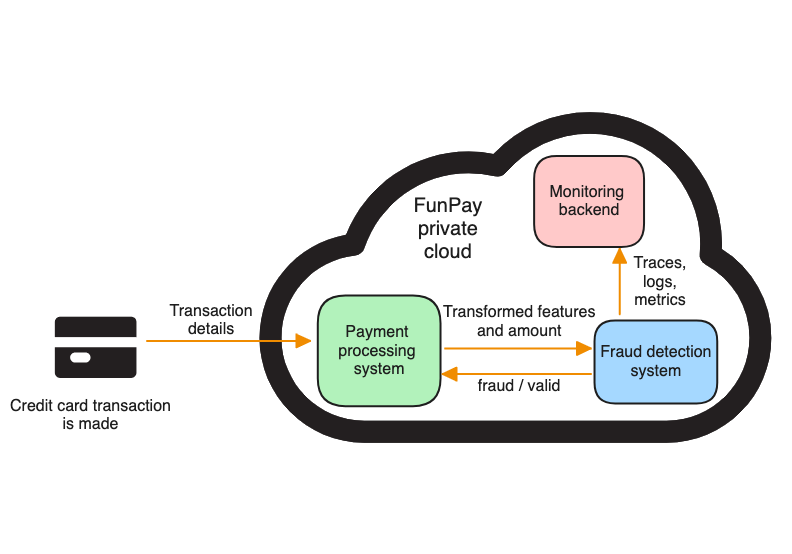

# Design document

<!--
This template is a guideline/checklist and is **not meant to be exhaustive**. The intent of the design doc is to help you think better (about the problem and design) and get feedback. Adopt whichever sections — and add new sections — to meet this goal. View other templates and examples [here](#other-templates-examples-etc).
-->

<style>
  ol {
    counter-reset: item;
  }
  ol > li {
    display: block;
  }
  ol > li:before {
    content: counters(item, ".") ". ";
    counter-increment: item;
  }
</style> 

## Table of contents

1. [Overview](#1-overview)
2. [Motivation](#2-motivation)
3. [Success metrics](#3-success-metrics)
4. [Requirements & constraints](#4-requirements--constraints)
    1. [Functional requirements](#41-functional-requirements)
    2. [Non-functional requirements](#42-non-functional-requirements)
    3. [What is in-scope & out-of-scope?](#43-what-is-in-scope--out-of-scope)
    4. [What are our assumptions?](#44-what-are-our-assumptions)
5. [Methodology](#5-methodology)
    1. [Problem statement](#51-problem-statement)
    2. [Data](#52-data)
    3. [Techniques](#53-techniques)
    4. [Experimentation & validation](#54-experimentation--validation)
        1. [Before deployment](#541-before-deployment)
        2. [After deployment](#542-after-deployment)
    5. [Human-in-the-loop](#55-human-in-the-loop)
6. [Implementation](#6-implementation)
    1. [High-level design](#61-high-level-design)
    2. [Technological choices](#62-technological-choices)
    3. [Infrastructure & scalability](#63-infrastructure--scalability)
    4. [Performance](#64-performance)
    5. [Security](#65-security)
    6. [Data privacy](#66-data-privacy)
    7. [Monitoring & alarms](#67-monitoring--alarms)
    8. [Cost](#68-cost)
    9. [Integration points](#69-integration-points)
    10. [Risks & uncertainties](#610-risks--uncertainties)
7. [Appendix](#7-appendix)
    1. [Alternatives](#71-alternatives)
    2. [Experiment Results](#72-experiment-results)
    3. [Milestones & timeline](#73-milestones--timeline)
    4. [References](#74-references)

<div class="page-break"></div>

## 1. Overview

<!--
A summary of the doc's purpose, problem, solution, and desired outcome, usually in 3-5 sentences.
-->

FunPay is considering a new internal service that would help prevent credit card frauds. This document proposes a design of such a service in order to get feedback on the design.

## 2. Motivation

<!--
Why the problem is important to solve, and why now.
Why should we solve this problem? Why now?
Explain the motivation for your proposal and convince readers of its importance. What is the customer or business benefit? If you're building a replacement system, explain why improvements to the existing system will not work as well. If there are alternatives, explain why your proposed system is better.
-->

In the last few months, FunPay registered a significant increase in the number of fraudulent credit card transactions. All these frauds were reported by the users as the company does not have any fraud detection system in place. In most cases, the company had to refund the money to the users. In the other cases, the users lost their money. The last group of frauds are those caught neither by the company nor by the users. These are estimated to be around 10% of all fraudulent transactions.

The company is looking for a solution to detect and prevent these fraudulent transactions. This will benefit both the company and its users financially, and it will improve users' trust in the company.

<!--
Two-day data set: 284807 transactions
Number of users: 57000
Average number of transactions per user per day: 5
Transactions in month: 284807/2*30=4272105
Fraudulent: 0.00173
-->

_Table 1: Shows the number of transactions and the number of frauds in the last three months.
The last column shows the increase in the number of frauds compared to the previous month._

| Month     | Number of transactions | Number frauds | Percent of detected frauds | Increase in frauds |
|-----------|------------------------|---------------|----------------------------|--------------------|
| July      | 4,326,856              | 6,101         | 0.141%                     | –                  |
| August    | 4,386,752              | 6,887         | 0.157%                     | 11.3%              |
| September | 4,272,105              | 7,305         | 0.171%                     | 8.9%               |

_Table 2: Shows who reported the frauds and the loss for the company and users caused by the frauds._

<!--
Estimated undetected frauds = 10% of all frauds => Number frauds / 0.9 * 0.1 = 6101 / 0.9 * 0.1 = 678
User loss = (User-reported frauds + Estimated undetected frauds - Number of frauds refunded by FunPay) * Avg. transaction amount = (6101 + 678 - 4393) * 89.7 = 214024
-->

| Month | User-reported frauds | Automa-<br/>tically detected frauds | Estimated undetected frauds | Number of frauds refunded by FunPay | Percent refunded by FunPay | Avg. transaction amount | FunPay loss | User loss   | 
|-------|----------------------|-------------------------------------|-----------------------------|-------------------------------------|----------------------------|-------------------------|-------------|-------------|
| July  | 6,101                | 0                                   | 678                         | 4,393                               | 72%                        | 89.7 EUR                | 394,052 EUR | 214,024 EUR |
| Aug.  | 6,887                | 0                                   | 765                         | 5,096                               | 74%                        | 87.2 EUR                | 444,371 EUR | 222,883 EUR |
| Sept. | 7,305                | 0                                   | 812                         | 5,187                               | 71%                        | 88.3 EUR                | 458,012 EUR | 258,719 EUR |

## 3. Success metrics

<!--
What are the success criteria?
Usually framed as business goals, such as increased customer engagement (e.g., CTR, DAU), revenue, or reduced cost.
-->

According to the survey recently conducted by FunPay among existing users, credit card frauds were identified as a major concern by 60% of users. 20% of users had experienced credit card fraud while using FunPay credit cards. It is expected that the addition of automatic fraud detection will result in more user trust, thus resulting in increased FunPay credit card usage.

- Number of daily active users increases by at least 8%.
- Average number of credit card transactions per user per day increases by at least 10%.

Marketing this feature should also attract new users.

- Number of new users per month increases by at least 5%.

Most importantly, credit card frauds should be caught automatically, not relying on users reporting them after it is too late.

<!--
(7305+812)*0.7 = 5682 caught frauds
7305*0.2 = 1461 user-reported frauds
458012*0.4 = 183205 EUR
258719*0.4 = 103488 EUR
-->

- At least 70% of credit card frauds should be caught automatically. I.e., the recall should be at least 70%.
- Number of user-reported frauds decreases by at least 80%.
- Cost of refunds to the users decreases by at least 60%.
- Monetary loss of the users decreases by at least 60%.

It is important that the service does not consider valid transactions as fraudulent. The number of false positives should be kept low.

- The precision should be at least 95%.

Because the fraud detection will happen in real-time, the service should not noticeably slow down the payment process for the user.

- The latency of the service should be less than 800 ms.

## 4. Requirements & constraints

<!--
What are the requirements and constraints?
Functional requirements are those that should be met to ship the project. They should be described in terms of the customer perspective and benefit.
Non-functional/technical requirements are those that define system quality and how the system should be implemented. These include performance (throughput, latency, error rates), cost (infra cost, ops effort), security, data privacy, etc.
Constraints can come in the form of non-functional requirements (e.g., cost below $`x` a month, p99 latency < `y`ms)
-->

### 4.1 Functional requirements

- Credit card transactions that are found to be fraudulent are declined.
- Credit card transactions that are found to be valid are processed as usual.
- The recall is at least 75%.
- The precision is at least 95%.

### 4.2 Non-functional requirements

- Performance
    - The throughput of the service is at least 100 requests per second.
    - The service handles peaks of up to 1000 requests per second.
    - The P99 latency of the service is less than 800 ms.
    - The error rate of the service is less than 0.1%.
- Security & data privacy
    - The service is accessible only from the other company's systems.
    - The service does not store any data about the users or their transactions.
    - The service processes only numerical input variables, which are the result of a PCA transformation, and the transaction amount.
- Costs
    - The cost of the service is less than 0.01 EUR per transaction.

### 4.3 What is in-scope & out-of-scope?

<!--
Some problems are too big to solve all at once. Be clear about what's out of scope.
-->

The underlying model will be trained on a fixed set of data and a fixed number of features. When new data and/or features are obtained, the model will be redeployed manually. This process will not be automated. There are two main reasons for this decision:

1. The service is in its early stages, and it is necessary to get user feedback first before allocating more resources to the development of a more complicated solution.
2. Each new model needs to be thoroughly evaluated before being put into production.

In the future, the model could be re-trained continuously as new data is obtained. The new data will consist of:

- Transactions reported by users as valid that were considered fraudulent by the system.
- Transactions reported by users as fraudulent that were considered valid by the system.
- Transactions that were considered valid by the system and were not reported by users as fraudulent.
- Transactions that were considered fraudulent by the system and were not reported by users as valid.

Another feature that is out of scope is a predefined list of merchants that are considered fraudulent. In the first stage, the service will work only with credit card transaction data, without external data sources.

Lastly, the service threshold on when to consider a transaction as fraudulent will be fixed. In the future, it could depend on the transaction amount, i.e., high amount transactions could be considered fraudulent more easily. This is called
_Example-Dependent Cost-Sensitive Classification_.

### 4.4 What are our assumptions?

<!--
57000*5/10/60/60 = 7.9
-->

With around 57,000 users making 5 transactions per day on average, the average system load would be about 8 requests per second. It is also assumed that the occasional peaks are at most 100 requests per second.

## 5. Methodology

### 5.1. Problem statement

<!--
How will you frame the problem? For example, fraud detection can be framed as an unsupervised (outlier detection, graph cluster) or supervised problem (e.g., classification).
-->

FunPay has a dataset of previous transactions that contains labels on whether a given transaction was fraudulent or not. Therefore, a supervised approach will be used. The fraud detection will be framed as a binary classification task with the classes being fraudulent and non-fraudulent transaction.

Having high recall is more important than having high precision. FunPay wants to maximize caught fraud at the cost of more false alarms.

### 5.2. Data

<!--
Describe the data and entities your data science model will be using.
What data will you use to train your model? What input data is needed during serving?
-->

The dataset that will be used to train and evaluate the model is a collection of labeled transactions that FunPay processed in a span of two days in September 2023. It contains 284,807 transactions in total, 492 of which are frauds (i.e., only 0.173%). This makes it a highly imbalanced dataset.

To comply with user data privacy, the original features have been transformed using PCA into 28 numerical floating point features, named V1,..., V28. Those are the principal components obtained with PCA.

The data also contain untransformed transaction amount (in EUR; floating point number) and the label (1 meaning fraudulent, 0 meaning valid). These are named "Amount" and "Class", respectively. The minimal amount is 0 (transactions that validate if a credit card is valid), and the maximum is 25,691.16 EUR.

### 5.3. Techniques

<!--
Outline the data science techniques you'll try/tried. Include baselines for comparison.
What machine learning techniques will you use? How will you clean and prepare the data (e.g., excluding outliers) and create features?
-->

The data science team has received the data already pre-processed from the payment processing team. The dataset does not have any missing values. Therefore, no imputation techniques need to be used. The dataset may contain some outliers. These will be removed using the Isolation Forest method. The dataset contains 29 features and the target variable. No further features need to be created.

Two baseline models should be included for comparison with more complicated models – one that classifies each transaction as non-fraudulent and the second one that uses Naive Bayes. Preliminary analysis has been conducted, and machine learning models such as Random Forest Classifier and Logistic Regression give good results. These models should be explored further. Lastly, it would be good to try solving the problem using neural networks.

### 5.4. Experimentation & validation

<!--
Explain how you'll evaluate models offline. Explain your choice of evaluation metrics(s).
How will you validate your approach offline? What offline evaluation metrics will you use?

If you're A/B testing, how will you assign treatment and control (e.g., customer vs. session-based), and what metrics will you measure? What are the success and [guardrail](https://medium.com/airbnb-engineering/designing-experimentation-guardrails-ed6a976ec669) metrics?
-->

#### 5.4.1 Before deployment

The data will be split into two parts. 70% will be used for training, and 30% will be used for the final validation of the chosen model. To compare various models and their hyperparameters, the training data will be further split using stratified k-fold with 10 folds. This will result in multiple average cross-validated scores. The most relevant metrics are recall and precision. Because of the high-class imbalance, accuracy is not a good metric. The area under the precision-recall curve (AUPRC) will be used instead.

#### 5.4.2 After deployment

An A/B test will be conducted. The treatment and control groups will be customer-based and will be assigned randomly. 50% of users will be assigned to the treatment group and 50% to the control group. The treatment group will have fraud detection enabled, while the control group will not.
The following metrics will be monitored for both groups:

- Number of daily active users
- Average number of credit card transactions per user per day
- Number of user-reported frauds
- Cost of refunds to the users
- Monetary loss of the users

In addition to these metrics, the following metrics will be monitored for the treatment group:

- True positives – when the system detected a transaction as fraudulent and the user did not raise a complaint
- True negatives – when the system detected a transaction as valid and the user did not raise a complaint
- False positives – when the user had to manually allow a transaction that was considered fraudulent by the system
- False negatives – when the system detected a transaction as valid and the user later raised a complaint on the transaction being fraudulent

This test will run for 30 days. At the end, recall and precision will be calculated, and a decision will be made on whether the system meets the expectations defined in [section 3](#3-success-metrics). Besides meeting these success metrics, the company's guardrail metrics will be monitored, too. If the average transaction processing time exceeds 2000 ms, the experiment will be considered a failure.

### 5.5. Human-in-the-loop

<!--
How will you incorporate human intervention into your ML system (e.g., product/customer exclusion lists)?
-->

Users will be able to set a maximum amount, up to which the transactions will be automatically accepted. This amount cannot be larger than 100 EUR.

When a credit card transaction is considered fraudulent, users are notified. They can then review the transaction, and if they find that it was a false positive, they can still allow it. Optionally, they can choose to consider all future transactions from the given merchant as valid. This will minimize the inconvenience for the users.

<div class="page-break"></div>

## 6. Implementation

### 6.1. High-level design

<!--
Start by providing a big-picture view. [System-context diagrams](https://en.wikipedia.org/wiki/System_context_diagram) and [data-flow diagrams](https://en.wikipedia.org/wiki/Data-flow_diagram) work well.

Data stores, pipelines (e.g., data preparation, feature engineering, training), and serving.
-->

[//]: # (![High-level design]&#40;./diagrams/high-level-design.excalidraw.png&#41;)

<div style="text-align:center;">

<p style="font-style:italic;">Figure 1: High-level design</p>
</div>


The model uses data from the product team that are already pre-processed and, therefore, does not require any data preparation pipeline. All features are available. No new features need to be created. The service does not store any data.

The model will be trained and deployed manually. It is expected that this process will be automated in the future. However, this is out of scope for now.

### 6.2. Technological choices

For training the model, Python low-code machine learning library [Pycaret](https://pycaret.org/) will be used. FunPay does not have a dedicated data science team. Therefore, it is important to use a tool that is easy to use for so-called
_citizen data scientists_. Pycaret is a good choice for this use case.

The trained model will then be deployed in a [Docker](https://www.docker.com/) container as a web service using [FastAPI](https://fastapi.tiangolo.com/).

### 6.3. Infrastructure & scalability

<!--
How will you host your system? On-premise, cloud, or hybrid? This will define the rest of this section.
List the infra options and your final choice.
-->

FunPay operates its private cloud, where most of the company's services are deployed.
Deploying the fraud detection service there will make the deployment easier, scalable and will also result in lower costs compared to using a public cloud. Furthermore, the service will be accessible only from the other company's systems, ensuring security.

The training will be done on virtual machines in this private cloud.

### 6.4. Performance

<!--
How will your system meet the throughput and latency requirements? Will it scale vertically or horizontally?
-->

The cloud infrastructure will allow for easy horizontal and/or vertical scaling, should the need arise – either due to more users having fraud detection enabled or due to more complex models being deployed.

The system will be automatically horizontally scaled during request peaks.

Having the fraud detection service deployed in the same environment as the payment processing system will minimize the communication latency.

A model trained in Pycaret can be transpiler to other languages, such as C or Java. This will result in faster inference speed.

### 6.5. Security

<!--
How will your system/application authenticate users and incoming requests? If it's publicly accessible, will it be behind a firewall?
-->

The service will be accessible only from the other company's systems, which are already secured from attacks such as denial-of-service.

The service does not require authentication because all incoming requests have been previously authenticated by the payment processing system.

[Safety](https://github.com/pyupio/safety) will be used to analyze dependencies for security vulnerabilities.

[Bandit](https://github.com/PyCQA/bandit) will be used to analyze the code for security issues.

### 6.6. Data privacy

<!--
How will you protect and ensure the privacy of customer data? Will your system be compliant with data retention and deletion policies (e.g., [GDPR](https://gdpr.eu/what-is-gdpr/))?
-->

FunPay is a European company. As such, it is subject to the General Data Protection Regulation (GDPR). However, the fraud detection service will not store any data about the users or their transactions. The service will be trained on and later process only numerical input variables, which are the result of a PCA transformation, and the transaction amount.

### 6.7. Monitoring & alarms

<!--
How you'll monitor your system performance. 
How will you log events in your system? What metrics will you monitor and how? Will you have alarms if a metric breaches a threshold or something else goes wrong? List the alarms that will trigger human intervention (e.g., on-call).
-->

The service will be instrumented using [OpenTelemetry](https://opentelemetry.io/docs/instrumentation/python/). The OpenTelemetry data will be sent to a centralized [Prometheus](https://prometheus.io/) backend and displayed using [Grafana](https://grafana.com/). Alerting rules will be set up in Prometheus to notify the on-call engineer when a metric breaches a threshold.

The metrics that will be monitored and their thresholds for alerts are:

- Server-side latency – > 800 ms
- Throughput – < 100 requests per second
- Error rate – > 0.1%

### 6.8. Cost

<!--
How much will it cost to build and operate your system? Share estimated monthly costs (e.g., EC2 instances, Lambda, etc.)
It should include labor cost, cost of infrastructure, etc.
-->

Two engineers will be allocated to this project. The cost of their work is 10,000 EUR per month per person.
The initial deployment of this service is expected to take 2 months.
The operational cost of the infrastructure where the model will be trained is 1,000 EUR per month.
In total, the upfront costs are 42,000 EUR.

After the initial deployment, the same two engineers will continue to work on the service, applying insights from A/B testing and improving the model.
The operational cost of the infrastructure where the model will be deployed is 1,000 EUR per month.
Because the company's SRE team will be responsible for the maintenance of the deployed application,
there are few additional labor costs associated with the operation of the service.

<!--
(2*10000+1000)/4000000 = 0.00525 EUR
-->
Assuming 4,000,000 transactions per month, the cost of the service is 0.005 EUR per transaction.

<div class="page-break"></div>

### 6.9. Integration points

<!--
How will your system integrate with upstream data and downstream users?
-->

The payment processing system will send a request to the fraud detection service when a credit card transaction is being processed. The request will contain the transaction amount and the principal components obtained with PCA. The service will respond with a boolean value indicating whether the transaction is considered fraudulent or not.

Sample request:

```json
{
  "Amount": 149.62,
  "V1": -1.36,
  "V2": -0.07,
  ...,
  "V28": 2.54
}
```

Sample response:

```json
{
  "fraudulent": false
}
```

### 6.10. Risks & uncertainties

<!--
Risks are the known unknowns; uncertainties are the unknown unknowns. Call them out to the best of your ability. This allows reviewers to help spot design flaws and rabbit holes, and provide feedback on how to avoid/address them.
What worries you, and you would like others to review?
-->

The collected dataset might not be representative enough and the model might not generalize well to new data.

The model might not be able to detect new types of fraud that were not present in the training data.

Some information might be lost during the PCA transformation.

<!--
Other stuff: ops strategy (e.g., monitoring, on-call), model rollbacks, quality assurance, extensibility, and model footprint and power consumption (if used in mobile apps).
-->

## 7. Appendix

### 7.1. Alternatives

<!--
What alternatives did you consider and exclude? List the pros and cons of each alternative and the rationale for your decision.
-->

#### Google Vertex AI

[Google Vertex AI](https://cloud.google.com/vertex-ai) platform has been considered as an alternative. It can be used both for model training and model deployment.

Training the model requires uploading the data to Google Cloud. The Google Cloud is well-secured, and the data are anonymized through PCA. Therefore, from the security and data privacy point of view, this does not pose any risks.
The model can then be trained using either _AutoML_ or newer _AutoML on Pipelines_. At the time of writing, using
_AutoML on Pipelines_ resulted in multiple issues and the training could not be completed. Training using
_AutoML_ was successful.

The model can be deployed as a web service – an
_endpoint_ in Google's terminology. This endpoint can be configured to be private only, which is an important requirement of the system.
However, testing of the endpoint showed that the inference speed was very slow and would not satisfy the latency requirement of 800 ms.

Lastly, the usage of Google Vertex AI for model training and model deployment resulted in high costs.
Leveraging the existing infrastructure of FunPay to train and deploy the models will reduce the costs significantly.

### 7.2. Experiment Results

<!--
Share any results of offline experiments that you conducted.
-->

Experiments show that precision of 95% and recall of 79% are achievable using a Random Forest Classifier. The respective AUPRC was 0.85.

<!--
### 7.3. Performance benchmarks

Share any performance benchmarks you ran (e.g., throughput vs. latency vs. instance size/count).
-->

### 7.3. Milestones & timeline

<!--
What are the key milestones for this system and the estimated timeline?
-->

- January 2024: Start of the project
- March 2024: Service is deployed as an A/B test
- April 2024: A/B test is finished, the service is evaluated and potentially deployed to all users

<!--
### 7.5. Glossary

Define and link to business or technical terms.
-->

### 7.4. References

<!--
Add references that you might have consulted for your methodology.
-->

The template for this design document is based on:

- Yan, Ziyou. (Feb 2021). How to Write Better with The Why, What, How Framework. eugeneyan.com. https://eugeneyan.com/writing/writing-docs-why-what-how/.
- Yan, Ziyou. (Mar 2021). How to Write Design Docs for Machine Learning Systems. eugeneyan.com. https://eugeneyan.com/writing/ml-design-docs/.
- Yan, Ziyou. (Mar 2023). ml-design-docs https://github.com/eugeneyan/ml-design-docs.

The content of the document is inspired by the _Credit Card Fraud
Detection_ dataset by Machine Learning Group of ULB (Université Libre de Bruxelles) retrieved from https://www.kaggle.com/datasets/mlg-ulb/creditcardfraud/data in October 2023.

The high-level design diagram was created using these icons:

- ["Credit Card SVG Vector"](https://www.svgrepo.com/svg/513398/credit-card) by [Pixelbazaar](https://www.svgrepo.com/author/pixelbazaar/) is licensed under [CC BY 4.0](https://creativecommons.org/licenses/by/4.0/)
- ["Cloud SVG Vector"](https://www.svgrepo.com/svg/113080/cloud) by [SVG Repo](https://www.svgrepo.com/) is licensed under [CC0 1.0](https://creativecommons.org/publicdomain/zero/1.0/)

<!--

# Other templates, examples, etc

- [How to Write Better with The Why, What, How Framework](https://eugeneyan.com/writing/writing-docs-why-what-how/)
- [A Software Design Doc](https://www.industrialempathy.com/posts/design-doc-a-design-doc/) `Google`
- [Design Docs at Google](https://www.industrialempathy.com/posts/design-docs-at-google/) `Google`
- [Product Spec of Emoji Reactions on Twitter Messages](https://docs.google.com/document/d/1sUX-sm5qZ474PCQQUpvdi3lvvmWPluqHOyfXz3xKL2M/edit#heading=h.554u12gw2xpd) `Twitter`
- [Design Docs, Markdown, and Git](https://caitiem.com/2020/03/29/design-docs-markdown-and-git/) `Microsoft`
- [Technical Decision-Making and Alignment in a Remote Culture](https://multithreaded.stitchfix.com/blog/2020/12/07/remote-decision-making/) `Stitchfix`
- [Design Documents for Chromium](https://www.chromium.org/developers/design-documents) `Chromium`
- [PRD Template](https://works.hashicorp.com/articles/prd-template) and [RFC Template](https://works.hashicorp.com/articles/rfc-template) (example RFC: [Manager Charter](https://works.hashicorp.com/articles/manager-charter)) `HashiCorp`
- [Pitch for To-Do Groups and Group Notifications](https://basecamp.com/shapeup/1.5-chapter-06#examples) `Basecamp`
- [The Anatomy of a 6-pager](https://writingcooperative.com/the-anatomy-of-an-amazon-6-pager-fc79f31a41c9) and an [example](https://docs.google.com/document/d/1LPh1LWx1z67YFo67DENYUGBaoKk39dtX7rWAeQHXzhg/edit) `Amazon`
- [Writing for Distributed Teams](http://veekaybee.github.io/2021/07/17/p2s/), [How P2 Changed Automattic](https://ma.tt/2009/05/how-p2-changed-automattic/) `Automattic`
- [Writing Technical Design Docs](https://medium.com/machine-words/writing-technical-design-docs-71f446e42f2e), [Writing Technical Design Docs, Revisited](https://medium.com/machine-words/writing-technical-design-docs-revisited-850d36570ec) `AWS`
- [How to write a good software design doc](https://www.freecodecamp.org/news/how-to-write-a-good-software-design-document-66fcf019569c/) `Plaid`
-->
